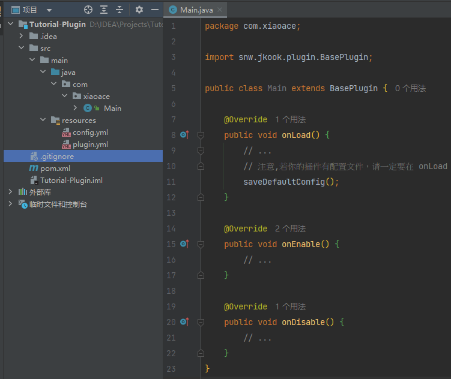

# 💻开工

## 一个插件必要的东西

一个能够正常运行的插件，至少要有主类与plugin.yml。

如果你想插件拥有可配置项，那么还得添加config.yml文件。

### 主类

插件的主类应该继承 snw.jkook.plugin.BasePlugin 类  
并且重写 onLoad() onEnable() onDisable() 方法  

onLoad内的代码会在插件加载时运行，一般在此时释放资源文件与配置文件  
onEnable内的代码在插件加载完成后并且插件正式启用后运行  
onDisable内的代码则会在插件卸载时运行

```java
import snw.jkook.plugin.BasePlugin;

public class Main extends BasePlugin {

    @Override
    public void onLoad() {
        // ...
        // 注意,若你的插件有配置文件，请一定要在 onLoad 中调用 saveDefaultConfig() 方法
        saveDefaultConfig();
    }

    @Override
    public void onEnable() {
        // ...
    }

    @Override
    public void onDisable() {
        // ...
    }
}
```

### plugin.yml

创建好主类后，应该就要着手开始编写plugin.yml了，这里存放着插件的描述信息。 
放在项目的 resources 中  
使用 YAML 格式编写

!> 请注意: YAML 对缩进要求很严格。

这篇教程中，笔者将插件命名为: Tutorial-Plugin 版本号: 1.0  
JKook api所用的版本为: 0.49.2   
主类路径为: com.xiaoace.Main.java
故填写如下
```
name: Tutorial-Plugin
version: 1.0
api-version: 0.49.2
authors: ["xiaoACE"]
main: com.xiaoace.Main
```

### config.yml

与 plugin.yml一样，使用 YAML 格式编写。这里存放着插件的可配置项。  
放在项目的 resources 中  
更详情的介绍请看[配置系统](文档/插件/Config.md)

!> 注意，若你的插件中有配置文件，请一定要在 onLoad 中调用 saveDefaultConfig() 方法。  
因为 JKook API 的实现会在 onLoad 方法完成后，才会将配置文件加载到内存当中。

这是一个配置文件的示例
```
# 该项配置的注释，可写可不写，写了方便告诉普通用户这个配置项是干什么的
# 机器人的管理员 填写用户ID
Admin:
  - 3983019112
```

## 准备工作完成

若你已经完成了以上的步骤，此时将项目打包成jar文件后并放到JKook api实现的plugins文件夹中，启动机器人，你的插件就会被正常加载。

## 此时项目文件结构

