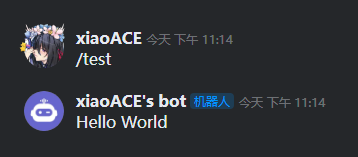

# 人生的第一个命令

做完前面的准备工作，该让机器人干点实质性的工作啦。  
一般来说，这种社交软件的机器人通常都拥有各式各样的命令，  
比如什么打卡、信息查询...  
让我们也来为机器人编写一个指令吧！

## Hello World

教程为了方便，直接将命令写在了主类里。

在频道里或者私信发送 /test 机器人将会响应一条 "Hello World" 文字消息。

```java
@Override
public void onEnable() {
    // 命令: /test
    new JKookCommand("test", "/")
            .setDescription("命令的描述信息，使用/help命令时显示")
            .setHelpContent("命令的具体描述，使用/help test时显示")
            // sender 为命令发送者 arguments 为命令执行时所带的参数 message 为触发命令时的消息对象
            .setExecutor((sender, arguments, message) -> {
                // 注意，如果使用 plugin.getCore().getCommandManager().executeCommand() 方法来执行命令
                // message 将会为 null
                message.sendToSource("Hello World");
            }).register(this);

    // 如果不想在链式调用里面直接注册命令，也可以使用这个方法注册
    JKookCommand testCommand = new JKookCommand("test", "/")
                .setDescription("命令的描述信息，使用/help命令时显示")
                .setHelpContent("命令的具体描述，使用/help test时显示")
                // sender 为命令发送者 arguments 为命令执行时所带的参数 message 为触发命令时的消息对象
                .setExecutor((sender, arguments, message) -> {

                    // 注意，如果使用 plugin.getCore().getCommandManager().executeCommand() 方法来执行命令
                    // message 将会为 null
                    message.sendToSource("Hello World");

                });

    getCore().getCommandManager().registerCommand(this,testCommand);
}
```
