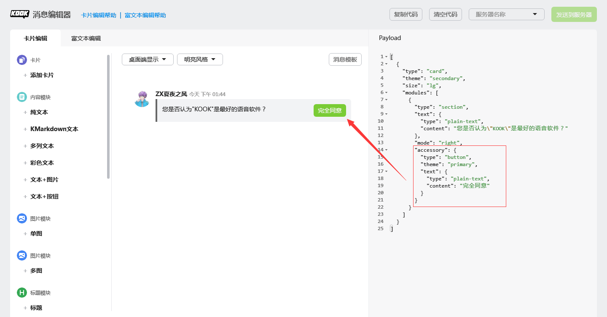
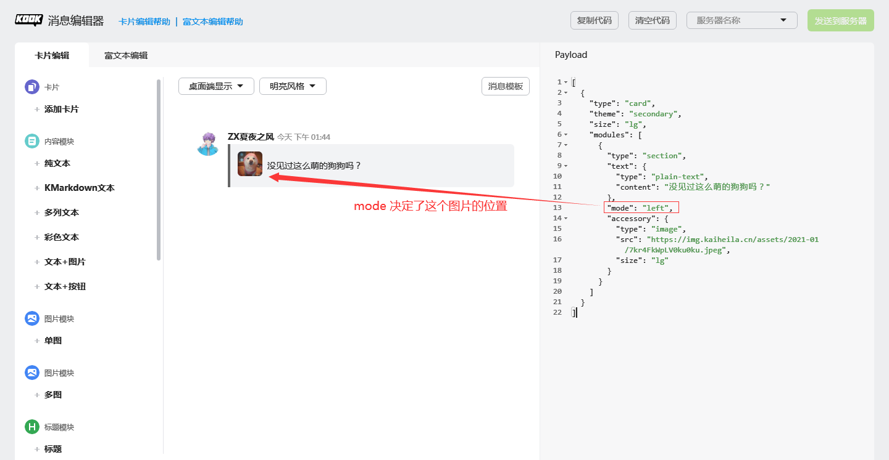
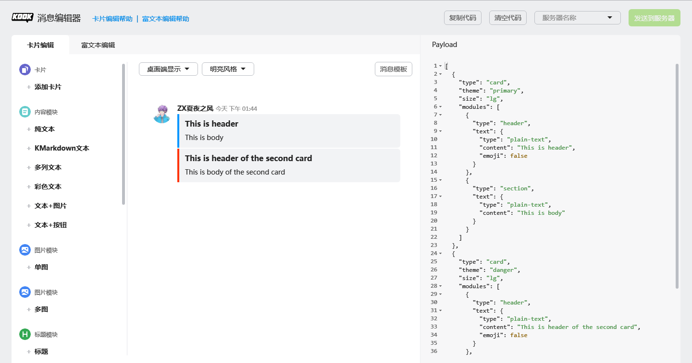

## CardMessage

> 卡片消息是一种结构化的消息，提供了一种易用、统一的富交互形式。
> 
> --- KOOK 开发者文档，有修改

在阅读本节前，建议先阅读 KOOK 开发者文档中对于 [CardMessage](https://developer.kookapp.cn/doc/cardmessage) 的介绍，然后体验一下 KOOK 的 [卡片消息编辑器](https://kookapp.cn/tools/message-builder.html#/card) 。

卡片消息有如下特性:
* 美观
* 提供按钮作为新的交互形式
* 一条卡片消息中可以存放 5 张卡片，一条卡片消息中最多可以有 50 个模块（Module）。 **"卡片消息"在这里不可和"卡片"混为一谈。**

JKook API 中关于 CardMessage 的内容放在了 `snw.jkook.message.component.card` 包下。

这里先讲解几个重要的类： `CardComponent`，`MultipleCardComponent`，`Theme`，`Size` 以及 `CardBuilder` 。

`CardComponent` 表示单个卡片组件。

`MultipleCardComponent` 是一个可存放最多 5 张卡片的容器组件。

`Theme` 枚举列出了 KOOK 支持的几种 "风格" ，它可以影响卡片本身以及特定元素的颜色。

`Size` 枚举存放了 Bootstrap 中的 4 种栅格布局。
* 卡片本身仅支持 `LG` 与 `SM` 。剩余的是为卡片模块准备的。如果你不知道卡片使用什么大小好，那就去用 `LG` 吧。
* 卡片本身在移动端 KOOK 只会使用 `SM` 大小。
* Bootstrap 是前端框架，不在本教程范围中，只是 KOOK 用到了，故此处不作详细讲解。

`CardBuilder` 是一个基于建造者模式设计的卡片构造工具类。

### 各种元素

所有可以组成卡片的元素的顶级父类为 `CardScopeElement` ，位于 `snw.jkook.message.component.card` 包。

根据 KOOK 开发者文档，我们将组成卡片的各种元素分为了 `Element` （基础元素），`Module` （模块），`Structure` （结构体）。

本节不再详细讲解元素的结构，各种元素类均是按照 KOOK 开发者文档封装的，阅读 KOOK 开发者文档即可。

#### Accessory

其完整限定名为 `snw.jkook.entity.abilities.Accessory` 。

`Accessory` 表示一种可以嵌入进其他卡片元素的元素。

如 `ButtonElement` 即为一种 `Accessory` 。

举两个例子:





可以嵌入其他卡片元素的元素为 `AccessoryHolder` ，目前只有 `SectionModule` 是其子类。

### CardBuilder

本节讲解 `CardBuilder` 的基本用法。

在 `CardBuilder` 类的源代码中，我们已经提供了一个小例子，它的源代码如下（有稍作改动）:

```java
MultipleCardComponent card = new CardBuilder()
     .setTheme(Theme.PRIMARY)
     .setSize(Size.LG)
     .addModule(new HeaderModule(new PlainTextElement("This is header", false)))
     .addModule(new SectionModule(new PlainTextElement("This is body"), null, null))
     .newCard()
     .setTheme(Theme.DANGER)
     .setSize(Size.LG)
     .addModule(new HeaderModule(new PlainTextElement("This is header of the second card", false)))
     .addModule(new SectionModule(new PlainTextElement("This is body of the second card"), null, null))
     .build();
```

这个示例在 KOOK 消息编辑器中的渲染效果为下图:

